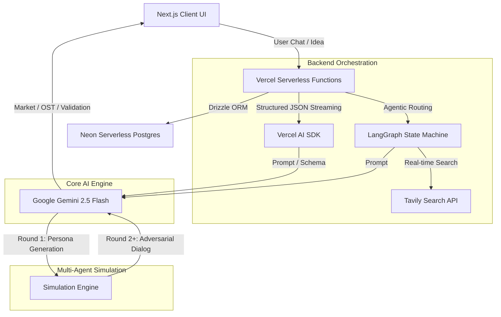

# Blueprint.AI

An elite, stateful AI-native execution engine designed to transform vague startup ideas into validated, market-ready engineering roadmaps. Built with Next.js, Google Gemini, LangGraph, and a Multi-Agent Simulation Engine.

## Core Features

- **Stateful Startup Planner Agent**: A LangGraph-powered conversational agent that uses Tavily Search API to pull real-time market data (TAM, SAM, SOM) and competitor intelligence.
- **4-Phase Generation Pipeline**: Dynamically generates a comprehensive execution plan spanning Market Analysis, Opportunity Solution Tree (OST), Mom Test Validation, and an Engineering Roadmap.
- **Multi-Agent Simulation Engine**: Automatically instantiates multiple distinct AI personas (e.g., CISO, Head of Finance, Early Adopter) to simulate parallel, multi-round adversarial stress tests of your startup idea.
- **Mom Test Evaluator**: An adversarial AI agent that grades real-world customer interview transcripts, penalizing hypothetical "future-tense" validation and compliment traps to ensure ground-truth signal.
- **Human-in-the-Loop (HITL) Governance**: Strict stateful guardrails that block roadmap advancement until the founder provides empirical real-world validation data.

## System Architecture

The application relies on a modern, serverless AI stack utilizing Vercel's Node.js runtime to process complex, long-running agent workflows without timeouts.



## Tech Stack

- **Frontend**: Next.js 16 (App Router), React, Tailwind CSS, Framer Motion, Lucide Icons.
- **AI Stack**: Google Gemini (`gemini-2.5-flash`), Vercel AI SDK (`ai`), LangChain Core, LangGraph.
- **Database**: Neon Serverless Postgres, Drizzle ORM.
- **Authentication**: NextAuth (Auth.js) with Passkey support.
- **Deployment**: Vercel.

## Getting Started

1. **Clone the repository** and install dependencies:
   ```bash
   npm install
   ```

2. **Set up Environment Variables**:
   Create a `.env.local` file and add the following:
   ```env
   # Database
   DATABASE_URL="your_neon_postgres_url"

   # AI Providers
   GOOGLE_GENERATIVE_AI_API_KEY="your_gemini_api_key"
   TAVILY_API_KEY="your_tavily_api_key"

   # Auth
   NEXTAUTH_URL="http://localhost:3000"
   NEXTAUTH_SECRET="your_secret"
   ```

3. **Push the database schema**:
   ```bash
   npx drizzle-kit push
   ```

4. **Run the development server**:
   ```bash
   npm run dev
   ```

5. Open [http://localhost:3000](http://localhost:3000) to view the application.

## The Validation Philosophy

Blueprint.AI is built on the philosophy that **LLMs are excellent at structuring logic, but terrible at generating ground-truth**. 

Therefore, the system intentionally blocks founders from treating the AI as an "auto-pilot". Using pessimistic confidence scoring and adversarial transcript evaluation, Blueprint.AI forces founders to conduct real-world customer discovery, effectively weaponizing the AI to hold the human accountable.
